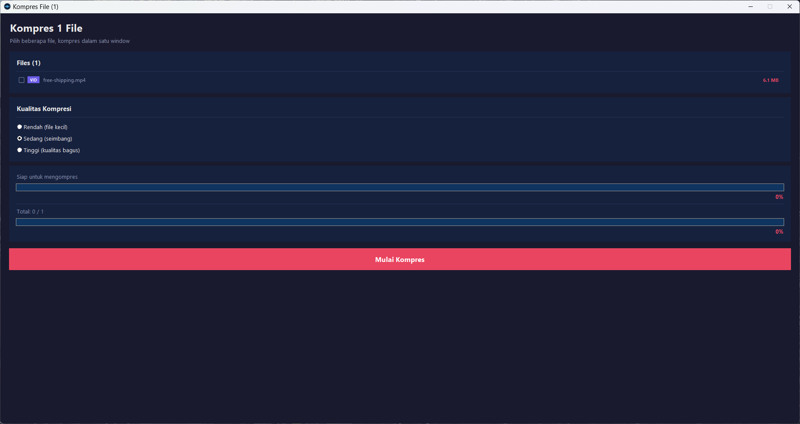
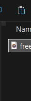

# Kompres File

Tool kompresi video & foto yang terintegrasi dengan **Windows Context Menu**. Klik kanan file → Kompres — langsung dari File Explorer!


## ✨ Fitur

- **Context Menu Integration** — Klik kanan langsung di File Explorer
- **Multi-file** — Pilih banyak file, kompres dalam satu window
- **Video Compression** — Menggunakan FFmpeg (H.264/AAC)
- **Photo Compression** — Menggunakan Pillow dengan resize & quality control
- **3 Level Kualitas** — Rendah, Sedang, Tinggi
- **Dark Theme GUI** — Tampilan modern dan elegan
- **Progress Real-time** — Progress bar per-file dan total
- **Silent Launch** — Tidak ada terminal/console window yang muncul

## 📁 Format yang Didukung

| Video | Foto |
|-------|------|
| MP4, AVI, MKV, MOV | JPG, JPEG, PNG, BMP |
| WMV, FLV, WEBM, M4V, 3GP | TIFF, TIF, WEBP, GIF |

## 🚀 Instalasi

### Prasyarat

1. **Python 3.8+** — [Download Python](https://www.python.org/downloads/)
2. **FFmpeg** (untuk kompresi video) — [Download FFmpeg](https://ffmpeg.org/download.html)
   - Pastikan `ffmpeg` dan `ffprobe` ada di PATH sistem
3. **Pillow** (untuk kompresi foto):
   ```
   pip install Pillow
   ```

### Setup Context Menu

1. Clone atau download repository ini
2. Klik kanan `install_context_menu.bat` → **Run as administrator**
3. Selesai! Sekarang klik kanan file video/foto di File Explorer

### Uninstall

Klik kanan `uninstall_context_menu.bat` → **Run as administrator**

## 📖 Cara Penggunaan

### Satu File
1. Klik kanan file video/foto di File Explorer
2. Pilih **"Kompres Video"** atau **"Kompres Foto"**
3. Pilih kualitas kompresi
4. Klik **"Mulai Kompres"**
5. File hasil tersimpan di folder yang sama dengan suffix `_compressed`

### Banyak File
1. Pilih beberapa file (Ctrl+klik atau Shift+klik)
2. Klik kanan → **"Kompres Video"** / **"Kompres Foto"**
3. Semua file tampil dalam **satu window**
4. Kompres semua sekaligus secara berurutan

## 🎨 Screenshot

### Context Menu
Klik kanan file di File Explorer → "Kompres Video" / "Kompres Foto"



### GUI Aplikasi
Tampilan modern dark theme dengan progress bar real-time



## 📂 Struktur Project

```
kompres-file/
├── compressor.py              # Aplikasi utama (GUI + kompresi)
├── compress.vbs               # Silent launcher (no console)
├── compress.bat               # Launcher alternatif
├── install_context_menu.bat   # Installer context menu (Run as Admin)
├── uninstall_context_menu.bat # Uninstaller context menu (Run as Admin)
├── kompres.ico                # Icon aplikasi
├── requirements.txt           # Dependencies
└── README.md
```

## ⚙️ Konfigurasi Kualitas

### Video (FFmpeg CRF)
| Level | CRF | Preset | Keterangan |
|-------|-----|--------|------------|
| Rendah | 32 | fast | File paling kecil |
| Sedang | 26 | medium | Seimbang |
| Tinggi | 20 | slow | Kualitas terbaik |

### Foto (Pillow)
| Level | Quality | Resize | Keterangan |
|-------|---------|--------|------------|
| Rendah | 30% | 50% | File paling kecil |
| Sedang | 60% | 75% | Seimbang |
| Tinggi | 85% | 100% | Kualitas terbaik |

## 🔧 Teknologi

- **Python** — Tkinter GUI
- **FFmpeg** — Kompresi video (H.264 + AAC)
- **Pillow** — Kompresi & resize foto
- **Windows Registry** — Context menu integration
- **Named Mutex** — Single instance (multi-file → satu window)

## 📄 Lisensi

MIT License — Bebas digunakan dan dimodifikasi.
